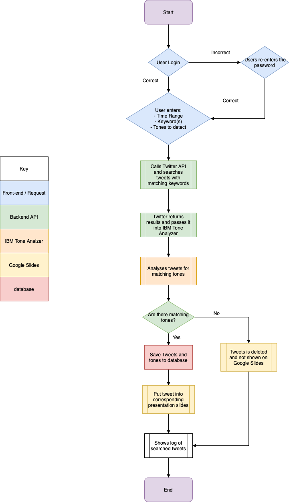

# 1. AIWorkFlow API Documentation

---

## 1.1. Table of Contents
- [1. AIWorkFlow API Documentation](#1-aiworkflow-api-documentation)
  - [1.1. Table of Contents](#11-table-of-contents)
  - [1.2. API User flow diagram](#12-api-user-flow-diagram)
  - [1.3. API Endpoints](#13-api-endpoints)
    - [1.3.1. API for Twitter](#131-api-for-twitter)
      - [1.3.1.1. Save Tweets](#1311-save-tweets)
        - [1.3.1.1.1. Endpoint](#13111-endpoint)
        - [1.3.1.1.2. Accepted Methods](#13112-accepted-methods)
        - [1.3.1.1.3. Parameters](#13113-parameters)
        - [1.3.1.1.4. Results](#13114-results)
      - [1.3.1.2. Search Tweets](#1312-search-tweets)
        - [1.3.1.2.1. Endpoint](#13121-endpoint)
        - [1.3.1.2.2. Accepted Methods](#13122-accepted-methods)
        - [1.3.1.2.3. Parameters](#13123-parameters)
        - [1.3.1.2.4. Results](#13124-results)

---

## 1.2. API User flow diagram



---

## 1.3. API Endpoints

### 1.3.1. API for Twitter

API search in Twitter in Twitter API key with the input keywords

#### 1.3.1.1. Save Tweets

Saves tweets to database

##### 1.3.1.1.1. Endpoint

    /twitterapi/tweets

##### 1.3.1.1.2. Accepted Methods

```txt
 POST 
```

##### 1.3.1.1.3. Parameters

| Parameter  | Type    | Description         |
| ---------- | ------- | ------------------- |
| user_id    | string  | Unique User ID      |
| tweet_text | string  | Tweet text          |
| keyword    | string  | user keyword        |
| tone       | string  | Detected tone       |
| tone_score | integer | Detected tone score |
| success    | boolean | response success    |

e.g. 

```json
{
    "user_id": "123456789",
    "tweet_text": "This is a tweet",
    "tone": "Anger",
    "keyword": "tweet",
    "tone_score": 0.5,
    "success": true
}
```

##### 1.3.1.1.4. Results

**Success:**

```json
{  
    "data": {
      "tweet_id": "123456789",
    },
    "message": "saved tweet successfully",
    "success": true
}
```

**Failed:**

```json
{  
    "data": {},
    "message": "Cannot save tweet - error",
    "success": false
}
```

#### 1.3.1.2. Search Tweets

Search tweet search and collect information in twitter according to the key words

##### 1.3.1.2.1. Endpoint

    /twitterapi/tweets

##### 1.3.1.2.2. Accepted Methods

```txt
 GET 
```

##### 1.3.1.2.3. Parameters

| Parameter          | Type    | Description                    |
| -------------------| ------- | ------------------------------ |
| user_id            | string  | Unique User ID                 |
| key_word           | string  | User input Key Word            |
| time_start         | string  | User input starting time range |
| time_end           | string  | User input ending time range   |
| tone               | string  | User-specified tone            |
| success            | boolean | request success                |
   


 e.g.

```json
{
    "user_id": "123456789",
    "keyword": "tweet",
    "time_start": "2021-01-01 21:00:00",
    "time_end": "2021-11-01 21:00:00",
    "tone": "happy",
    "success": true
}
```


##### 1.3.1.2.4. Results


**Success:**

```json
{  
    "data": {
      "tweets": [
        {
          "text": "I love IBM",
          "url": "https:/twitter.com/id/8013879718"
        },
        {
          "text": "I dislike IBM",
          "url": "https:/twitter.com/id/231233217"
        }
      ],
    },
    "message": "searched tweet successfully",
    "success": true
}
```


**Failed:**

```json
{  
    "data": {},
    "message": "Cannot search tweet - error",
    "success": false
}
```
